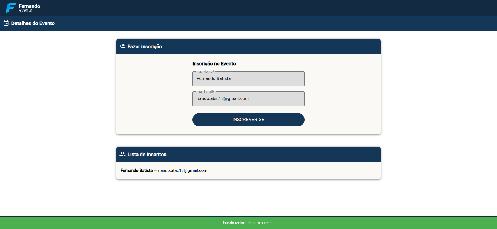

# technical-test

A technical test to demonstrate both hard and soft skills for a company evaluation.

Cloning the repository

1.1 ssh

```bash
git clone git@github.com:nandovx/technical-test.git
```

1.2 https

```bash
git clone https://github.com/nandovx/technical-test.git
```

## Part 1 - Logic

I choose the first question because I believe this is the most challenging.

> 🔸 1. Números únicos
>
> Escreva uma função que receba uma lista de números e retorne apenas os que não se repetem.
>
> Exemplo: Entrada: [1, 2, 2, 3, 4, 4, 5] → Saída: [1, 3, 5]

### 🛠 Requirements

- .NET SDK 8.0+ installed

  Check installation with:

  ```bash
  dotnet --version
  ```

### 🚀 How to Run

1. Navigate to the project folder

   ```bash
   cd technical-test
   cd Part1-Logic/uniqueNumber
   ```

2. Run the program

   ```bash
   dotnet run -- "1,2,3,3,4,4,5,6"
   ```

## Part 2 - Technical Communication

This folder contain a video and a image used to explain about Binary Search

### 📂 Folder structure

- `video-binary-search.mp4`  
   An explanatory video demonstrating binary search.

- `image-binary-search.png`  
   An illustrative image relevant to explanation.

## Part 3 - Practical Development


In this Part I developed a simple page using Angular.

### 📂 Folder structure

```
Part3-PracticalDevelopment/
│
├─ public/ # Publicly accessible static files
│
├─ src/
│ ├─ app/
│ │ ├─ core/ # Global services and models
│ │ │ ├─ model/ # TypeScript models (Person, Event)
│ │ │ └─ services/ # Business logic and communication services
│ │ │
│ │ ├─ features/ # Project-specific features
│ │ │ └─ event-page/ # Main event page
│ │ │ ├─ event-details/ # Event details components
│ │ │ └─ registration-form/ # Registration form
│ │ │
│ │ └─ shared/components/ # Shared components (Header, Footer)
│ │
│ ├─ app.component.* # Angular root component
│ ├─ app.routes.ts # Application routes
│ └─ app.config.* # Project configuration
│
├─ node_modules/ # Project dependencies
├─ .angular/ # Angular configuration
└─ .vscode/ # VS Code configuration
```

### ⚙️ Technologies and Tools

- **Angular (version 19)** – Main framework for SPA development
- **TypeScript** – Static typing and object orientation
- **SCSS** – Modular and reusable styling
- **Angular Material (optional)** – Ready-to-use UI components
- **ngx-toastr** – To notifications
- **VS Code** – Development editor

### 🚀 How to Run the Project

1. Install dependencies:

```bash
npm install
```

2. Start the development server:

```bash
ng serve
```

3. Access the application in your browser:

```text
http://localhost:4200
```

### 🧩 Main Components

- **EventPageComponent** – Main component for the event page

- **EventDetailComponent** – Displays event details (title, description, attendee list)

- **RegistrationFormComponent** – Registration form with validations and data submission

- **HeaderComponent / FooterComponent** – Shared components for consistent layout
